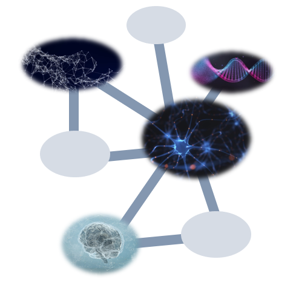

<meta name="google-site-verification" content="mdGMtWoEKGGK0TGevR0jQm-X4f9rVK6wmYAT8bG8Qeg" />

# Bioinformatica

Welcome to the working repository for Bioinformatica! Here I will apply various bioinformatics analysis techniques to TCGA-LLG data in an effort to both cement my understanding of these topics but also provide a resource for others learning bioinformatics. Topics will include: regression, ANOVA, model building, PCA, clustering, machine learning, network analysis, etc.

## Topics

#### [T-Test/Distributions][1]

#### [Linear Models][2]

#### [Error of the Mean/ Central Limit Theorem/ Confidence Intervals][3]

#### [ANOVA][4]

#### [Contingency Tables/Fisher Test/Chi-Square Test][5]

#### [Correlation/Resampling][6]

#### [Multiple Comparisons/Prediction][7]

#### [2-Way ANOVA][8]

#### [Random Effects/General Linear Models/Survival Analysis][9]

#### [PCA][10]

#### [Clustering][11]

#### [Normalization][12]

#### [Supervised Learning - Linear Regression][13]

#### [Supervised Learning - Classification/Logistic Regression][14]

#### [Supervised Learning - Naive Bayes/K-Nearest Neighbors][15]

#### [Supervised Learning - Neural Networks][16]

#### [Supervised Learning - Support Vector Machines][17]

[1]: https://github.com/BioNomad/Bioinformatica/blob/main/pages_you_can_read/ttest_distributions/ttest_distributions.md

[2]: https://github.com/BioNomad/Bioinformatica/blob/main/pages_you_can_read/models/linear_model.md

[3]: https://github.com/BioNomad/Bioinformatica/blob/main/pages_you_can_read/error_clt_ci/error_clt_ci.md

[4]: https://github.com/BioNomad/Bioinformatica/blob/main/pages_you_can_read/anova/anova.md

[5]: https://github.com/BioNomad/Bioinformatica/blob/main/pages_you_can_read/ct_ft_ct/ct_ft_ct.md

[6]: https://github.com/BioNomad/Bioinformatica/blob/main/pages_you_can_read/correlation_resampling/correlation_resampling.md

[7]: https://github.com/BioNomad/Bioinformatica/blob/main/pages_you_can_read/mc_pred/mc_pred.md

[8]: https://github.com/BioNomad/Bioinformatica/blob/main/pages_you_can_read/2_anova/2_anova.md

[9]: https://github.com/BioNomad/Bioinformatica/blob/main/pages_you_can_read/re_glm_sur/re_glm_sur.md

[10]: https://github.com/BioNomad/Bioinformatica/blob/main/pages_you_can_read/pca/pca.md

[11]: https://github.com/BioNomad/Bioinformatica/blob/main/pages_you_can_read/clustering/clustering.md

[12]: https://github.com/BioNomad/Bioinformatica/blob/main/pages_you_can_read/normalization/normalization.md

[13]: https://github.com/BioNomad/Bioinformatica/blob/main/pages_you_can_read/supervised_linear_reg/supervised_linear_reg.md

[14]: https://github.com/BioNomad/Bioinformatica/blob/main/pages_you_can_read/supervised_class_log/supervised_class_log.md

[15]: https://github.com/BioNomad/Bioinformatica/blob/main/pages_you_can_read/supervised_nb_kn/supervised_nb_kn.md

[16]: https://github.com/BioNomad/Bioinformatica/blob/main/pages_you_can_read/supervised_nn/supervised_nn.md

[17]: https://github.com/BioNomad/Bioinformatica/blob/main/pages_you_can_read/supervised_svm/supervised_svm.md

[logo]:images/info_graphic.PNG

