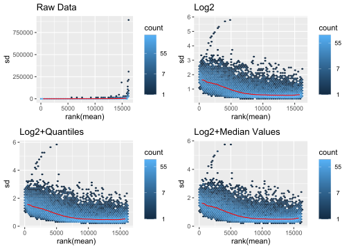

Normalization
================

So far, we haven’t paid too much attention to normalization. So what it
is it? Basically it is a process of taking values of variables of
different scales and bringing them to a common scale
([Wikipedia](https://en.wikipedia.org/wiki/Normalization_\(statistics\))).
In this way comparing them is a little more fair. So in the case of gene
expression we have read counts all over the place, and we normalize so
we can can compare them to each other. So far we have been taking the
`log2` of the data plus 1 and then normalizing by quantiles using the
`limma` library. Before normalizing though, it is worth talking about
filtering out genes by counts. In a given expression data set, there
will be genes expressed at very low levels and they are often removed to
increase the power of whatever analysis you are going to do ([Galaxy
Project](https://training.galaxyproject.org/training-material/topics/transcriptomics/tutorials/rna-seq-counts-to-genes/tutorial.html#filtering-to-remove-lowly-expressed-genes)).
Here we will remove genes that do not have a mean count above 10.

``` r
load("./lgg.rda")
library(limma)
library(viridis)
lgg$ExpressionData <- lgg$ExpressionData[rowMeans(lgg$ExpressionData)>10,]
#so what does our data initially look like?
boxplot(
  lgg$ExpressionData[,1:20],
  xaxt='n',
  col = magma(10)[2],
  border=magma(10)[1]
  )
```

<!-- -->

``` r
#what about taking the log?
boxplot(
  log2(lgg$ExpressionData+1)[,1:20],
  xaxt='n',
  col= magma(10)[5],
  border=magma(10)[7]
  )
```

<!-- -->

``` r
#now what about taking the log and normalizing by quantiles?
boxplot(
  normalizeQuantiles(log2(lgg$ExpressionData+1))[,1:20],
  xaxt='n',
  col=magma(10)[7],
  border=magma(10)[2]
  )
```

<!-- -->

Here we see that taking the `log2` does level the scales quite a bit,
but there is still some variation between samples. By using the `limma`
function `normalizeQuantiles()` we achieve a better stabilization
between patients. However, this is not the only choice in normalization
technique. The `limma` library has quite a few different normalization
methods to explore. While we can compare these methods by boxplots, it
is also useful to plot the standard deviation against the rank of the
mean. The `vsn` library has a great function, `meanSDPlot()` to
accomplish just that. In these plots we are essentially looking for the
“flattest” plot, indicating a more successful variance
stabilization.

``` r
library(ggplot2)
library(gridExtra)
#normal data
p1 <- meanSDPlot(
  as.matrix(lgg$ExpressionData),
  plot = FALSE
  )
#log data
p2 <- meanSDPlot(
  as.matrix(
    log2(lgg$ExpressionData+1)
  ),
  plot = FALSE
)
#log data and normalize by quantiles
p3 <- meanSDPlot(
  as.matrix(
    normalizeQuantiles(log2(lgg$ExpressionData+1))
  ),
  plot = FALSE
)
#log data and normalize by median values
p4 <- meanSDPlot(
  as.matrix(
    normalizeMedianValues(log2(lgg$ExpressionData+1))
  ),
  plot = FALSE
)
#let's plot!
grid.arrange(p1$gg+ggtitle("Raw Data"),
             p2$gg+ggtitle("Log2"),
             p3$gg+ggtitle("Log2+Quantiles"),
             p4$gg+ggtitle("Log2+Median Values"),
             ncol=2)
```

<!-- -->

Here again we can see that Log2 transformation does a lot of the work in
stabilizing variance. However, methods like `normalizeQuantiles()` and
`normalizeMedianValues()` do go further to provide a better variance
stabilization.

## References

1.  <https://en.wikipedia.org/wiki/Normalization_(statistics)>

2.  <https://training.galaxyproject.org/training-material/topics/transcriptomics/tutorials/rna-seq-counts-to-genes/tutorial.html#filtering-to-remove-lowly-expressed-genes>
