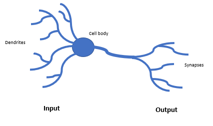
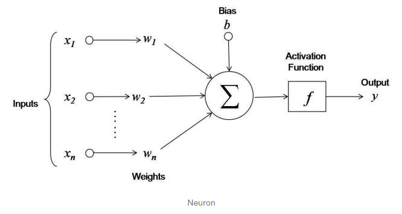
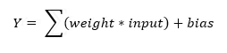
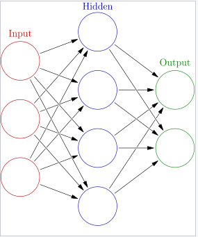
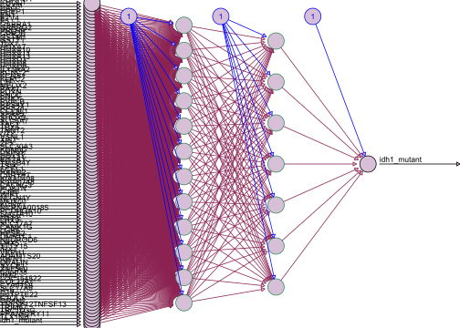

Supervised Learning - Neural Networks
================

Now let’s talk about arguably the most famous supervised learning
algorithm, neural networks\! First, it is helpful to review the anatomy
of a neuron:



So we can see that a neuron takes some input through the dendrites,
processes the information in the cell body and sends that signal out to
the synapses. Similarly a neuron in a neural network follows the same
pattern ([towards data
science](https://towardsdatascience.com/statistics-is-freaking-hard-wtf-is-activation-function-df8342cdf292)):



Where the output, **y** is equal to
([datacamp](https://www.datacamp.com/community/tutorials/neural-network-models-r)):



So we can see here that the inputs are each variable **x** multiplied by
a weight **w**, which are then summed and added to the bias term. This
process is known as the neural network’s activation function or mapping
of inputs to some output
([datacamp](https://www.datacamp.com/community/tutorials/neural-network-models-r)).
Now this is just for one neuron in a network, the whole network is
constructed like so
([Wikipedia](https://en.wikipedia.org/wiki/Artificial_neural_network)):



Where we get three layers: one of input neurons, a hidden layer where
they are given a chance to interconnect like real neurons, and an output
layer where we get the output of the model. Let’s get to coding\!

``` r
load("lgg.rda")
library(neuralnet)
library(limma)
#we are going to do something different here and use our gene expression data
#let's first filter, normalize and grab only the top 100 genes with the
#highest variance
filt.exp <- lgg$ExpressionData[rowMeans(lgg$ExpressionData)>10,]
log_trans <- log2(filt.exp+1)
norm_data <- normalizeQuantiles(log_trans)
vars <- rank(-apply(norm_data,1,var))<=100
#here we make sure our predictor variables are the columns
df <- as.data.frame(t(norm_data[vars,]))
#let's remove those pesky special characters from the gene names
colnames(df) <- gsub("-","",gsub("\\|.*","",colnames(df)))

#now let's try to predict IDH1 mutant status
df$idh1_mutant <- as.numeric(
  gsub(
  "WT","0",
  gsub(
    "Mutant","1",
    as.character(lgg$PatientData$paper_IDH.status)
    )))
df <- na.omit(df)
#let's make our formula!
MakeForumla <- function(data,y_value){
  condition <- colnames(data)!= y_value
  predictors <- paste(c(colnames(data[,condition])),collapse="+")
  formula <- formula(paste(c(y_value,predictors),collapse=""))
  return(formula)
}
formula <- MakeForumla(data = df,y_value = "idh1_mutant~")
```

Here we did a few pre-processing steps, so let’s go through them:

1.  We are building our model this time on gene expression data. So we
    need to filter out genes with very low counts, normalize our
    expression data, and for our predictors we are taking the genes with
    the highest variance.

2.  We will use these genes to predict IDH1 mutant status, so to do that
    we need to convert IDH1 mutant status to a numeric vector.

3.  This model is going to take in 100 genes\! That is a lot of
    predictors\! And we don’t want to have to write out the whole
    formula `idh1_mutant ~ Gene1 + Gene2 + Gene3 + ...`. So we make a
    function to do that for us.

Now let’s build the model\!

``` r
#split data into training and test data
set.seed(42)
train_ind <- sample(1:nrow(df), 0.8*nrow(df))
train <- df[train_ind, ]
test  <- df[-train_ind, ]
#now let's make our model!
nn_model =neuralnet(formula=formula,
                    data=train,
                    hidden=c(12,7),
                    linear.output = FALSE)

plot(nn_model,
     col.hidden = 'seagreen4',
     col.hidden.synapse = 'violetred4',
     show.weights = F,
     information = F,
     cex=.7,
     fill = 'thistle',
     rep = "best")
```

<!-- -->

So like the models we have made before, we split our data into training
and test data sets. Now we fill out the `neuralnet()` function:

  - `formula` takes the formula we made above

  - `data` takes in our training datset

  - `hidden` is the number of hidden layers in our neural network. So
    here we have two layers with the first layer having 12 nodes/neurons
    and the second layer having 7 nodes/neurons

  - `linear.output` we set to false because we are not applying a
    different function to our neurons.

We can visualize the neural network with the plot function and color it
how we like. As a side note, the `rep` option was set to best so that
the plot would show up on a R markdown document. Now let’s get those
stats\!

``` r
library(caret)
#let's make some predictions using the test data
nn_pred <- compute(nn_model, test)
#now let's turn the probabilities into classes
nn_pred_class <- as.numeric(ifelse(nn_pred$net.result>0.5, 1, 0))
#define our function to get class error
ClassError = function(actual, predicted) {
  mean(actual != predicted)
}
ClassError(actual = test$idh1_mutant,predicted = nn_pred_class)
```

    ## [1] 0.01941748

``` r
#now how about the confusion matrix?
nn_cm <- confusionMatrix(table(
  actual=test$idh1_mutant,
  predicted=nn_pred_class
))
c(nn_cm$overall["Accuracy"],
nn_cm$byClass["Sensitivity"],
nn_cm$byClass["Specificity"])
```

    ##    Accuracy Sensitivity Specificity 
    ##   0.9805825   0.9166667   0.9890110

Quite the model performance\! This model also has a very low error and
high accuracy, specificity, and sensitivity. However, we will see in the
upcoming section on Model/Feature Selection that all is not what it
seems.

## References

1.  <https://towardsdatascience.com/statistics-is-freaking-hard-wtf-is-activation-function-df8342cdf292>

2.  <https://www.datacamp.com/community/tutorials/neural-network-models-r>

3.  <https://en.wikipedia.org/wiki/Artificial_neural_network>
