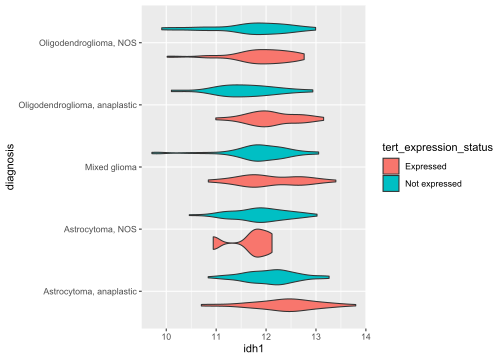
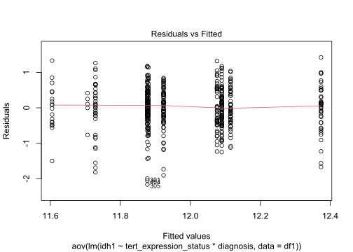
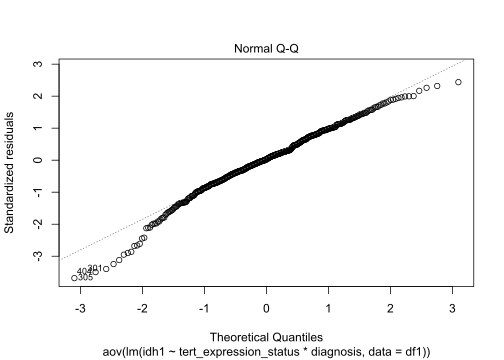

2-Way ANOVA
================

We talked about the One-Way ANOVA, where you compare differences between
2 or more groups
([Wikipedia](https://en.wikipedia.org/wiki/One-way_analysis_of_variance)).So
in the previous topic note we compared IDH1 expression across different
diagnoses. But what if we wanted to analyze IDH1 expression across *two*
categorical variables, say diagnoses and TERT expression status? For
that we would need the two way ANOVA. By performing a Two-Way ANOVA we
are testing for
([STHDA](http://www.sthda.com/english/wiki/two-way-anova-test-in-r)):

  - Differences between categorical variable A (diagnoses)
  - Differences between categorical variable B (TERT Expression Status)
  - An interaction between categorical variables A and B (diagnoses and
    TERT Expression Status)

So let’s get to coding\!

``` r
load("./lgg.rda")
library(limma)
library(car)
#remember to normalize!
log.trans <- log2(lgg$ExpressionData + 1)
norm.data <- normalizeQuantiles(log.trans)

#grab gender, diagnoses, and IDH1 expression data
tert_expression_status <- lgg$PatientData$paper_TERT.expression.status
diagnosis <- lgg$PatientData$primary_diagnosis
idh1 <- as.numeric(
  norm.data[grepl("IDH1",rownames(norm.data)),]
)
#make a dataframe
df <- data.frame(
  tert_expression_status=tert_expression_status,
  diagnosis=diagnosis,
  idh1=idh1
)
#remove NA's
df1 <- na.omit(df)
#check group membership
table(df1$diagnosis,df1$tert_expression_status)
```

    ##                                
    ##                                 Expressed Not expressed
    ##   Astrocytoma, anaplastic              41            88
    ##   Astrocytoma, NOS                      5            59
    ##   Mixed glioma                         46            85
    ##   Oligodendroglioma, anaplastic        59            18
    ##   Oligodendroglioma, NOS               73            38

``` r
#let's get to the two-way ANOVA
res <- aov(lm(idh1~tert_expression_status*diagnosis,data = df1))
#summary of the results
Anova(res, type = "III")
```

    ## Anova Table (Type III tests)
    ## 
    ## Response: idh1
    ##                                  Sum Sq  Df    F value    Pr(>F)    
    ## (Intercept)                      6277.6   1 17971.8541 < 2.2e-16 ***
    ## tert_expression_status              2.3   1     6.4543  0.011369 *  
    ## diagnosis                           6.1   4     4.3634  0.001774 ** 
    ## tert_expression_status:diagnosis    1.9   4     1.3941  0.234783    
    ## Residuals                         175.3 502                         
    ## ---
    ## Signif. codes:  0 '***' 0.001 '**' 0.01 '*' 0.05 '.' 0.1 ' ' 1

Here we can see that TERT expression status and diagnosis are associated
with IDH1 expression. However, the interaction of the two is not
significantly associated with IDH1 expression.To identify which group
was deviant we simply plotted the distributions. Note that we use the
`ANOVA()` function from the car library since our design isn’t balanced
(that just means we don’t have the same number of subjects in each
group). Now we face the problem of finding out *which* groups are
significantly different. We can get a little more official though by
leveraging Tukey Honest Significant Differences and the pairwise t-test
([Wikipedia](http://www.sthda.com/english/wiki/two-way-anova-test-in-r)):

``` r
#let's identify significant differences between diagnoses using the Turkey
#Honest Significant Differences
thsd <- TukeyHSD(res, which = "diagnosis")
thsd[["diagnosis"]][,4][thsd[["diagnosis"]][,4]<0.05]
```

    ##              Astrocytoma, NOS-Astrocytoma, anaplastic 
    ##                                          2.365569e-02 
    ##                  Mixed glioma-Astrocytoma, anaplastic 
    ##                                          1.046921e-02 
    ## Oligodendroglioma, anaplastic-Astrocytoma, anaplastic 
    ##                                          1.758783e-02 
    ##        Oligodendroglioma, NOS-Astrocytoma, anaplastic 
    ##                                          7.487765e-06

``` r
#now how about the pairwise t-test:
pair.t <- pairwise.t.test(df1$idh1, df1$diagnosis,
                p.adjust.method = "BH")
pair.t[["p.value"]]
```

    ##                               Astrocytoma, anaplastic Astrocytoma, NOS
    ## Astrocytoma, NOS                         0.0035413949               NA
    ## Mixed glioma                             0.0063199976        0.4765463
    ## Oligodendroglioma, anaplastic            0.0846675766        0.3419338
    ## Oligodendroglioma, NOS                   0.0003884919        0.9166648
    ##                               Mixed glioma Oligodendroglioma, anaplastic
    ## Astrocytoma, NOS                        NA                            NA
    ## Mixed glioma                            NA                            NA
    ## Oligodendroglioma, anaplastic    0.6369722                            NA
    ## Oligodendroglioma, NOS           0.3503051                     0.2398723

``` r
#now let's take a look at all the data
library(ggplot2)
ggplot(df1, aes(x=diagnosis, y=idh1,fill=tert_expression_status)) + 
  geom_violin()+
  coord_flip()
```

<!-- -->

These results are a tad more official than the simple visual inspection
we performed, and we identified more diagnoses with significant
differences in means\!

## Assumption/Limitations

Now we do need to consider the drawbacks here. Like the One-Way ANOVA,
it is assumed that
([Wikipedia](https://en.wikipedia.org/wiki/Two-way_analysis_of_variance)):

  - independence of the observations
  - normality of the residuals (can be tested with the Shapiro Test)
  - Variances in each group should be the same (homoscedasticity)

But let’s revisit testing these:

``` r
#use the car library for homoscedasticity test
plot(res, 1)
```

<!-- -->

``` r
leveneTest(idh1~diagnosis*tert_expression_status,data = df1)
```

    ## Levene's Test for Homogeneity of Variance (center = median)
    ##        Df F value Pr(>F)
    ## group   9  1.0424 0.4048
    ##       502

``` r
#now what about the residuals?
plot(res, 2)
```

<!-- -->

``` r
shapiro.test(residuals(res))
```

    ## 
    ##  Shapiro-Wilk normality test
    ## 
    ## data:  residuals(res)
    ## W = 0.98135, p-value = 3.905e-06

Here we see that while variances are pretty consistent and the p-value
of the levene test asserts that. However, the shapiro test demonstrates
that the residuals do not follow a normal distribution. This might be
caused by the presence of a non-linear relationship. Still, it is
important to explore these metrics to get the best possible
understanding of how our data are related.

## References

1.  <https://en.wikipedia.org/wiki/One-way_analysis_of_variance>

2.  <http://www.sthda.com/english/wiki/two-way-anova-test-in-r>

3.  <https://en.wikipedia.org/wiki/Two-way_analysis_of_variance>
