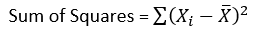
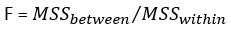
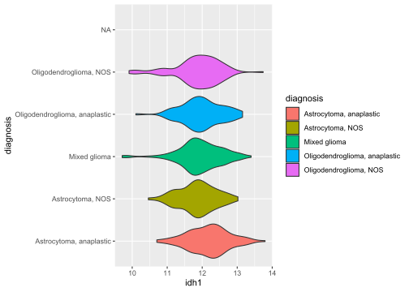

ANOVA
================

So what IS an ANOVA? Well an ANOVA is essentially just a statistical
test of whether or not two or more groups have the same mean
([Wikipedia](https://en.wikipedia.org/wiki/Analysis_of_variance)). When
you are comparing two groups using an ANOVA, the results are actually
the same. Let’s illustrate that\!

``` r
load("./lgg.rda")

#let's see if the ANOVA and t-test can come up with the same result
#when comparing sex v. IDH1 expression

library(limma)
log.trans <- log2(lgg$ExpressionData + 1)
norm.data <- normalizeQuantiles(log.trans)

#grab sex and IDH1 expression data
sex <- lgg$PatientData$gender
idh1 <- as.numeric(
  norm.data[grepl("IDH1",rownames(norm.data)),]
)
                    
#let's use the t-test:
t.test(idh1~as.factor(sex),var.equal=TRUE)
```

    ## 
    ##  Two Sample t-test
    ## 
    ## data:  idh1 by as.factor(sex)
    ## t = -0.73428, df = 531, p-value = 0.4631
    ## alternative hypothesis: true difference in means is not equal to 0
    ## 95 percent confidence interval:
    ##  -0.14393271  0.06560866
    ## sample estimates:
    ## mean in group female   mean in group male 
    ##             11.95808             11.99724

``` r
#and now the anova
anova(lm(idh1~as.factor(sex)))
```

    ## Analysis of Variance Table
    ## 
    ## Response: idh1
    ##                 Df  Sum Sq Mean Sq F value Pr(>F)
    ## as.factor(sex)   1   0.202 0.20249  0.5392 0.4631
    ## Residuals      531 199.420 0.37556

Woah, cool right\! Before we dig deeper, we should explore the logic
behind the ANOVA. Let’s start with the sum of squares, or the sum of the
deviations from a mean. So if you have a list of numbers `4,5,4,3,6`,
the mean would be `4.4`. The sum of squares would just be adding the
square of how far away each number in the list is from the mean:

Formula:



\*\* Xi = value at i, X = mean

Worked Example:

    sum of squares = (4-4.4)^2 + (5-4.4)^2 + (4-4.4)^2 + (3-4.4)^2 + (6-4.4)^2 = 5.2

Now we **variance** is this sum of squares divided by the degrees of
freedom `n - 1`:


Worked Example:

    variance = 5.2/(n-1) = 5.2/(5-1) = 5.2/4 = 1.3

or in R:

``` r
var(c(4,5,4,3,6))
```

    ## [1] 1.3

Now an ANOVA uses the variance within groups (so how far away each value
is to the group mean - a.k.a MSS within) and the variance between groups
(how far each group’s mean is from the overall mean - a.k.a MSS
between). Now we are in a position to get the F-statistic we say in the
ANOVA results above:



So let’s do this the easy way with the `anova()` function and test
multiple groups this time:

``` r
#so let's use ANOVA to analyze IDH1 expression across different primary diagnoses:

#normalize and filter
library(limma)
log.trans <- log2(lgg$ExpressionData + 1)
norm.data <- normalizeQuantiles(log.trans)
diagnosis <- lgg$PatientData$primary_diagnosis

#grab IDH1 expression and diagnoses
idh1 <- as.numeric(
  norm.data[grepl("IDH1",rownames(norm.data)),]
)
df <- data.frame(
  diagnosis = diagnosis,
  idh1 = idh1
)

#implement the ANOVA:
anova(lm(idh1~as.factor(diagnosis),data = df))
```

    ## Analysis of Variance Table
    ## 
    ## Response: idh1
    ##                       Df  Sum Sq Mean Sq F value  Pr(>F)    
    ## as.factor(diagnosis)   4   7.624 1.90607  5.2417 0.00038 ***
    ## Residuals            528 191.998 0.36363                    
    ## ---
    ## Signif. codes:  0 '***' 0.001 '**' 0.01 '*' 0.05 '.' 0.1 ' ' 1

## Assumptions/Limitations

Now might be a good time to talk about some assumptions/limitations. So
above we saw that there is a significant difference between groups.
**BUT** we don’t see which group is significantly different. We could
calculate means for each group or we could visualize the distributions:

``` r
library(ggplot2)
ggplot(df, aes(x=diagnosis, y=idh1,fill=diagnosis)) + 
  geom_violin()+
  coord_flip()
```

<!-- -->

So here we can see that anaplastic astrocytomas have a slightly higher
mean than the other groups.

It is also important that here we are using the ANOVA on a linear model
and as such we need to consider the assumptions of a linear model
([Wikipedia](https://en.wikipedia.org/wiki/Analysis_of_variance)):

  - independence of the observations
  - normality of the residuals (can be tested with the Shapiro Test)
  - Variances in each group should be the same (homoscedasticity)

That last point is important, because as you may have noted above, the
t-test results and the ANOVA results are only the same when the
variances are assumed to be equal. Despite these limitations, the ANOVA
is still a powerful tool in assessing differences between groups.

## References

1.  <https://en.wikipedia.org/wiki/Analysis_of_variance>
