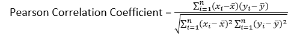
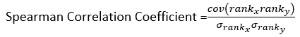
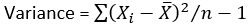
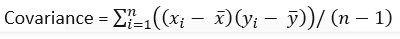
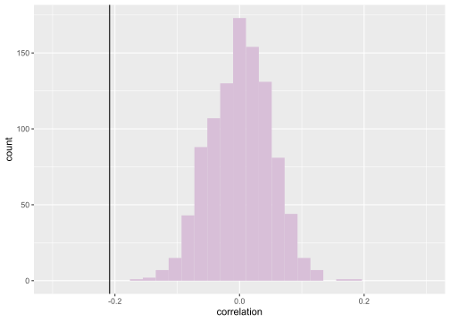

Correlation/Resampling
================

To kick off resampling, it is helpful to revisit plain old statistical
sampling. Well in taking a sample you are trying to characterize the
underlying population
([Wikipedia](https://en.wikipedia.org/wiki/Sampling_\(statistics\))).
And you can do this by applying some of the techniques we have talked
about so far. So why would you want to resample and what does that mean?
Well since our sample is really only an estimate of the true underlying
population, it can still lead to spurious results. To better understand
how good our sample is, we can shuffle, replace, or test it’s predictive
power. That is resampling
([Wikipedia](https://en.wikipedia.org/wiki/Resampling_\(statistics\))).

## Correlation

Before we jump into resampling let’s take a quick look at correlation.
So correlation is a statistical relationship between two random
variables
([Wikipedia](https://en.wikipedia.org/wiki/Correlation_and_dependence)).
Now you will probably hear most about correlation assessing linear
relationships or monotonic relationships. A linear relationship is often
assessed using the Pearson correlation coefficient:



Where xi is the value of variable x at i, yi is the value of variable y
at i, n is the number of observations, x is the mean of variable x, and
y is the mean at variable y. Now if one is looking for a non-linear
relationship, the Spearman Correlation Coefficient is often used
([Wikipedia](https://en.wikipedia.org/wiki/Spearman%27s_rank_correlation_coefficient)):



Where rank x is the rank of variable x, rank y is the rank of variable
y, cov is the covariance between these two, and o rank x/ o rank y are
the standard deviations of the ranked variables. At this point you might
be wondering what are rank and covariance? Well rank is just like it
sounds, it is the rank of each observation. So in a list `1,2,4,3,5`,
the rank would be `1,2,4,3,5`. Now covariance, sounds scary but it is
pretty similar to just regular old variance. So as a reminder, variance
is ([Wikipedia](https://en.wikipedia.org/wiki/Variance)):



All that’s changed in covariance is that the top of this fraction
includes the deviation from the second variable’s mean
([Wikipedia](https://en.wikipedia.org/wiki/Covariance)):



Now we can see that these coefficients are dependent on order. If you
start switching around data points you’re mixing which terms get
multiplied together in the summation. So how do we know if the
correlation coefficient does approximate the underlying distribution or
it’s just an artifact of sample order?

## Permutation

Well that is where permutation comes in handy. Permutation resampling
reshuffles the order of data to see if we can get the same value. Let’s
try it out\!

``` r
load("./lgg.rda")
library(ggplot2)
#now let's assess the correlation between mutation count and tumor ploidy
purity <- lgg$PatientData$paper_ABSOLUTE.purity[
  !is.na(lgg$PatientData$paper_ABSOLUTE.purity) &
    !is.na(lgg$PatientData$paper_ABSOLUTE.ploidy)
]
ploidy <- lgg$PatientData$paper_ABSOLUTE.ploidy[
  !is.na(lgg$PatientData$paper_ABSOLUTE.purity) &
    !is.na(lgg$PatientData$paper_ABSOLUTE.ploidy)
]
#what is the regular correlation?
cor.test(purity,ploidy)
```

    ## 
    ##  Pearson's product-moment correlation
    ## 
    ## data:  purity and ploidy
    ## t = -4.3492, df = 416, p-value = 1.721e-05
    ## alternative hypothesis: true correlation is not equal to 0
    ## 95 percent confidence interval:
    ##  -0.2984922 -0.1149317
    ## sample estimates:
    ##        cor 
    ## -0.2085478

``` r
#does this change
cors <- numeric()
for (i in 1:1000){
  purity.tmp <- sample(purity)
  ploidy.tmp <- sample(ploidy)
  cor.tmp <- cor(purity.tmp,ploidy.tmp)
  cors <- c(cors, cor.tmp)
}
df <- data.frame(correlation=cors)
ggplot(df, aes(x=correlation)) + 
  geom_histogram(fill="thistle") +
  xlim(c(-.3,.3))+
  geom_vline(xintercept = cor(purity,ploidy))
```

<!-- -->

So as we can, see our correlation is unlikely to be observed by chance,
as the p-value in the `cor.test()` function suggested\!

## Bootstrapping

Now what about the effect of outliers in a sample? Those can really mess
up the statistics like sample sample mean. Using bootstrapping we can
assess those by sampling our sample and replacing some of the data
points with copies of other data points
([Wikipedia](https://en.wikipedia.org/wiki/Resampling_\(statistics\))).
Let’s test that out on ploidy and purity\!

``` r
#let's load the special bootstrap library
library(boot)
#make a function that calculates correlation
cor.func <- function(df, i){
 df.tmp <- df[i,] 
 return(cor(df.tmp$paper_ABSOLUTE.purity, df.tmp$paper_ABSOLUTE.ploidy))
}
#remove the na's
cleaned <- lgg$PatientData[
    !is.na(lgg$PatientData$paper_ABSOLUTE.purity) &
    !is.na(lgg$PatientData$paper_ABSOLUTE.ploidy),
]
#run the bootstrap
boot.cor <- boot(cleaned,
                 cor.func,
                 R=1000)
boot.cor
```

    ## 
    ## ORDINARY NONPARAMETRIC BOOTSTRAP
    ## 
    ## 
    ## Call:
    ## boot(data = cleaned, statistic = cor.func, R = 1000)
    ## 
    ## 
    ## Bootstrap Statistics :
    ##       original       bias    std. error
    ## t1* -0.2085478 1.399382e-05  0.04854804

``` r
#now get the bootstrap confidence interval
boot.ci <- boot.ci(boot.out=boot.cor,
                   type="norm")
boot.ci
```

    ## BOOTSTRAP CONFIDENCE INTERVAL CALCULATIONS
    ## Based on 1000 bootstrap replicates
    ## 
    ## CALL : 
    ## boot.ci(boot.out = boot.cor, type = "norm")
    ## 
    ## Intervals : 
    ## Level      Normal        
    ## 95%   (-0.3037, -0.1134 )  
    ## Calculations and Intervals on Original Scale

Yay\! We just used bootstrapping\! Now what does all this mean? Well to
run a bootstrap resampling on our data we need to define the statistic
we are examining, that’s where `cor.func()` comes in. We set i as rows
because our variables are stored in columns. So if we are going to
replace a few of our values, we are replacing rows. The results we get
from 1000 bootstrap resamplings delivers the original correlation, the
bias, and the standard error. The confidence interval of this boot strap
gives us a range with a 95% confidence level that the true correlation
is somewhere between -0.3068 and -0.1109.

## References

1.  <https://en.wikipedia.org/wiki/Sampling_(statistics)>

2.  <https://en.wikipedia.org/wiki/Resampling_(statistics)>

3.  <https://en.wikipedia.org/wiki/Correlation_and_dependence>

4.  <https://en.wikipedia.org/wiki/Spearman%27s_rank_correlation_coefficient>

5.  <https://en.wikipedia.org/wiki/Variance>

6.  <https://en.wikipedia.org/wiki/Covariance>
