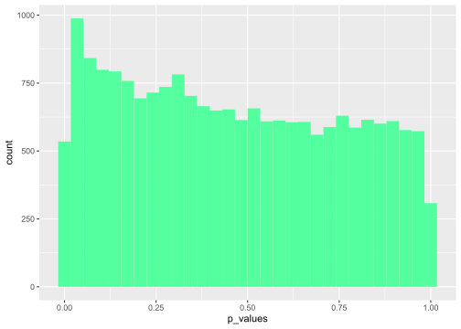
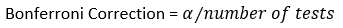
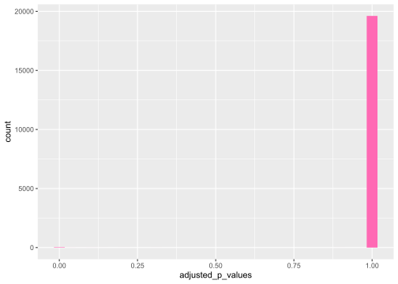
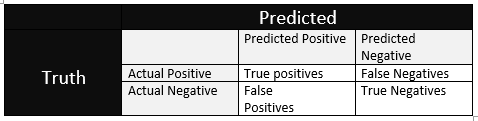
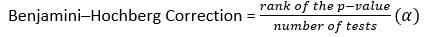

Multiple Comparisons/Prediction
================

So far we’ve really only been performing one significance test at a
time. But what if you want to perform many significance tests? Let’s say
we want to see which gene’s expression was significantly different
between male and female Low grade glioma patients. That is a **LOT** of
genes, nearly 20,000 of them\! But let’s do it\!

``` r
load("./lgg.rda")
library(ggplot2)
#set males and female condition
gender <- as.factor(lgg$PatientData$gender)
#now let's get some p-values!
pvals <- apply(lgg$ExpressionData,1,function(x){
  tmp=t.test(x~gender)$p.value;return(tmp)})
#get rid of na's
cleaned <- pvals[!is.na(pvals)]
#how about plotting all the different p-values
df <- data.frame(p_values = as.numeric(cleaned))
ggplot(df, aes(x=p_values)) + 
  geom_histogram(fill="seagreen1")
```

<!-- -->

``` r
#what's our most significant gene?
min(cleaned)
```

    ## [1] 1.883193e-129

``` r
which.min(cleaned)
```

    ## DDX3Y|8653 
    ##       5687

``` r
length(cleaned[cleaned <0.05])
```

    ## [1] 1470

This gene isn’t terribly surprising considering it is a gene located on
the Y chromosome
([GeneCards](https://www.genecards.org/cgi-bin/carddisp.pl?gene=DDX3Y)).
And it looks like 1470 genes are significantly different\! But there is
a really big problem here. We just performed nearly 20,000 tests. There
is a chance that we have a significant result just by chance (*Gasp*).
Luckily there is a way to account for this. We just need to alter our
alpha, or significance threshold. Here are a few methods to do just that
([Wikipedia](https://en.wikipedia.org/wiki/Multiple_comparisons_problem)):




So let’s see the distribution of p-values after Bonferrroni correction:

``` r
adjusted <- p.adjust(pvals,method = "bonferroni")
adjusted <- adjusted[!is.na(adjusted)]
df.adj <- data.frame(adjusted_p_values = as.numeric(adjusted))
ggplot(df.adj, aes(x=adjusted_p_values)) + 
  geom_histogram(fill="hotpink")
```

<!-- -->

``` r
#how many significant genes do we have now?
length(adjusted[adjusted <0.05])
```

    ## [1] 41

This is a very different story from above. We only have 41 genes that
are still signficant after correction. And while the Bonferroni
correction is one of the strictest correction methods out there, it
still goes to show that without correction, we are susceptible to false
positives.

## Prediction

Speaking of false positive, that term deserves a little more
clarification. Let’s start with the confusion matrix
([Wikipedia](https://en.wikipedia.org/wiki/Sensitivity_and_specificity)):



Now we can take these values and calculate:

  - Negative Predictive Value = True Negatives/(True Negatives+False
    Negatives)

  - Positive Predictive Value = True Positives/(True Positives + False
    Positives)

  - False Discovery Rate = 1-Positive Predictive Value = False
    Positives/(True Positives + False Positives)

  - Sensitivity/True Positive Rate = True Positives/Actual Positives =
    True Positives/(True Positives + False Negatives)

  - Specificity/ True Negative Rate = True Negatives/Actual Negatives =
    True Negatives/(True Negatives + False Positives) = 1 - False
    Positive Rate

Now let’s think of these terms more generally. Sensitivity is assessing
how many true events are we catching and specificity is assessing how
many negative events we are catching. False Discovery Rate (FDR) is also
worth exploring more as it is the ratio of false positives you get out
of all positive results. Going back to our gene expression example, we
originally obtained 1470 significant results or overall positives. Let’s
see how they stand up to FDR evaluation:

``` r
library(qvalue)
#let's obtain q-values (A.K.A FDR)
qval.obj <- qvalue(pvals)
df <- data.frame(
  p_values = qval.obj$pvalues,
  q_values = qval.obj$qvalues
)
ggplot(df, aes(x=p_values, y=q_values)) + geom_point()
```

<!-- -->

``` r
#now let's correct by the Benjamini–Hochberg method - a method that corrects by false discovery rate
adjusted.BH <- p.adjust(pvals, method = "BH")
#how many significant genes passed BH correction
length(adjusted.BH[!is.na(adjusted.BH)<0.05])
```

    ## [1] 282

Hang on, there are more significant genes that passed our correction.
That’s because we correct by FDR instead of just simply dividing by the
number of tests. This is also arguably a more appropriate way of going
about p-value correction. But arguments aside, the BH correction follows
this formula ([Statistics How
To](https://www.statisticshowto.com/benjamini-hochberg-procedure/)):



Where alpha this time is the chosen FDR level.

## References

1.  <https://www.genecards.org/cgi-bin/carddisp.pl?gene=DDX3Y>

2.  <https://en.wikipedia.org/wiki/Multiple_comparisons_problem>

3.  <https://en.wikipedia.org/wiki/Sensitivity_and_specificity>

4.  <https://www.statisticshowto.com/benjamini-hochberg-procedure/>
