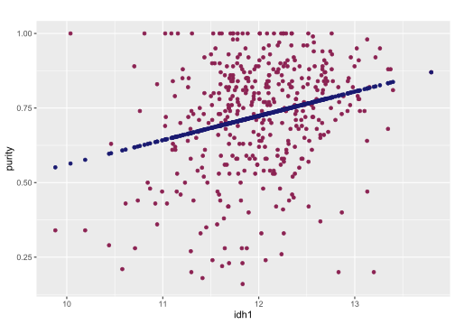
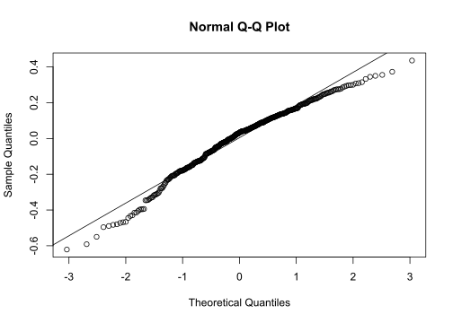
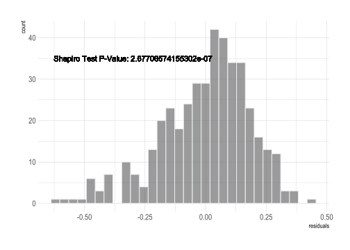
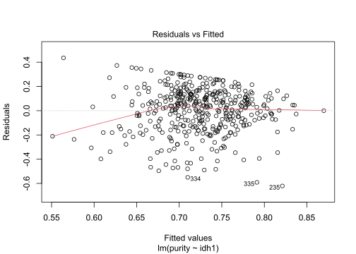
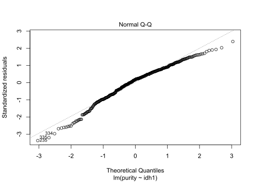
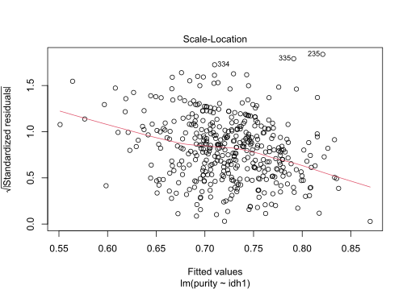
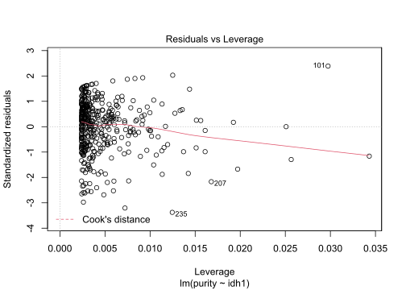

Linear Models
================

## Introduction

Here I’ll use linear models to examine low grade glioma data. Linear
models model the relationship between a scalar response and one or more
explanatory variables
([Wikipedia](https://en.wikipedia.org/wiki/Linear_regression)). Low
grade gliomas are characterized by IDH1 mutations
([NCBI](https://www.ncbi.nlm.nih.gov/pmc/articles/PMC7244462/#:~:text=Low%2Dgrade%20gliomas%20\(LGG\),and%20include%20astrocytomas%20and%20oligodendrogliomas.)).
So here we test how well IDH1 gene expression can predict tumor purity.

Let’s normalize the expression data by log2, normalize by quantiles and
only keep samples with tumor purity information.

``` r
library(limma)
library(ggplot2)
library(hrbrthemes)
load("./lgg.rda")
#normalize and filter
log.trans <- log2(lgg$ExpressionData + 1)
quant <- normalizeQuantiles(log.trans)
norm.data <- quant[!is.na(lgg$PatientData$paper_ABSOLUTE.purity)]
```

Now let’s take a look at how well IDH1 can predict tumor purity.

``` r
#grab IDH1 gene expression across samples and purity information
idh1 <- as.numeric(norm.data["IDH1|3417",])
purity <- lgg$PatientData$paper_ABSOLUTE.purity[!is.na(lgg$PatientData$paper_ABSOLUTE.purity)]
idh1.df <- cbind.data.frame(idh1,purity)
#contrsuct the linear model
lm.idh1 <- lm(purity ~ idh1,idh1.df)
#print model information
print(lm.idh1)
```

    ## 
    ## Call:
    ## lm(formula = purity ~ idh1, data = idh1.df)
    ## 
    ## Coefficients:
    ## (Intercept)         idh1  
    ##    -0.25294      0.08138

We can use our model to manually predict purity.

``` r
p1 <- ggplot(idh1.df, aes(x=idh1, y=purity)) + 
  geom_point(color="violetred4")+
  ggtitle("")
predicted <- cbind.data.frame(idh1=idh1,
                              predicted.purity=predict(lm.idh1))
p1 + geom_point(data=predicted,
                aes(x=idh1,y=predicted.purity),
                color="midnightblue")
```

<!-- -->

Now what about model quality? We can tell a lot from the residuals, or
deviation from the theoretical value
([Wikipedia](https://en.wikipedia.org/wiki/Errors_and_residuals)). So
let’s make some plots.

``` r
residuals <- data.frame(residuals=resid(lm.idh1))
qqnorm(resid(lm.idh1))
qqline(resid(lm.idh1))
```

<!-- -->

``` r
ggplot(residuals,aes(x=residuals)) +
  geom_histogram( color="#e9ecef", alpha=0.6, position = 'identity',
                  bins = 30) +
  theme_ipsum() +
  labs(fill="")+
  geom_text(x=(-0.3), y=35, label=paste("Shapiro Test P-Value:",
                                        as.character(shapiro.test(
                                          resid(
                                            lm.idh1
                                          )
                                        )$p.value
                                        )))
```

<!-- -->

Here we encounter a problem. We see in the qqplot that their is a bit of
a deviation from the theoretical and observed values. The histogram of
the residuals is also telling. The shapiro test delivers a very
significant p-value, indicating that the sample was not taken from a
normally distribution
([Wikipedia](https://en.wikipedia.org/wiki/Shapiro%E2%80%93Wilk_test)).
Now that we did that the hard way, there is a simpler way to deliver
this information.

``` r
plot(lm.idh1)
```

<!-- --><!-- --><!-- --><!-- -->

This command also delivers new plots for us to examine. The fitted
versus residuals plot shows us a few of the model characteristics. If
the residuals are randomly spread across the 0 line, the relationship is
most likely linear ([Penn
State](https://online.stat.psu.edu/stat462/node/117/)). If the residuals
are spread like a horizontal band, the variances of the error terms are
equal ([Penn State](https://online.stat.psu.edu/stat462/node/117/)).
Outliers in this plot can also be used to identify outliers in the
original data ([Penn
State](https://online.stat.psu.edu/stat462/node/117/)). The Cook’s
distance plot can also be used in assessing outliers as it measures the
effect of deleting data points
([Wikipedia](https://en.wikipedia.org/wiki/Cook%27s_distance)).

## References

1.  <https://en.wikipedia.org/wiki/Linear_regression>

2.  <https://www.ncbi.nlm.nih.gov/pmc/articles/PMC7244462/#>:\~:text=Low%2Dgrade%20gliomas%20(LGG),and%20include%20astrocytomas%20and%20oligodendrogliomas.

3.  <https://en.wikipedia.org/wiki/Errors_and_residuals>

4.  <https://en.wikipedia.org/wiki/Shapiro%E2%80%93Wilk_test>

5.  <https://online.stat.psu.edu/stat462/node/117/>

6.  <https://en.wikipedia.org/wiki/Cook%27s_distance>
