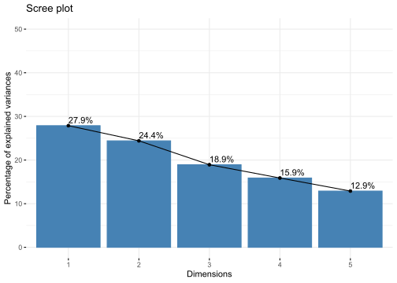
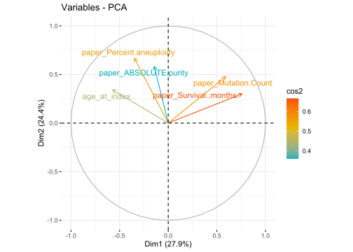
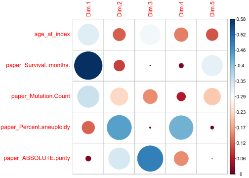
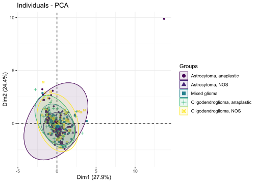

PCA
================

So what is PCA? PCA stands for principal component analysis
([STHDA](http://www.sthda.com/english/articles/31-principal-component-methods-in-r-practical-guide/112-pca-principal-component-analysis-essentials/)).
We use PCA when we are trying to glean information from highly
dimensionsal numeric data. For example in our LGG patient dataframe has
109 columns and while not *all* of these columns are numeric a lot of
them are. Trying to visualize all the data in those columns would be
rough. So PCA will idenitfy the **principal components** - basically a
graph where the most variance is
([STHDA](http://www.sthda.com/english/articles/31-principal-component-methods-in-r-practical-guide/112-pca-principal-component-analysis-essentials/)).
Each component will have an eigenvalue or the amount of variation that
component captures
([STHDA](http://www.sthda.com/english/articles/31-principal-component-methods-in-r-practical-guide/112-pca-principal-component-analysis-essentials/)).
It’s also reccomended that variables be scaled. By not scaling, you run
the risk of your principal components just being the variables with the
largest values. While information is lost in this dimension reduction it
can be a super useful tool to quickly identify interesting patterns in
your data. So let’s try it\!

``` r
library(factoextra)
library(FactoMineR)
library(corrplot)
load("./lgg.rda")
#let's create a numeric data frame to play around with
df <- lgg$PatientData[c("age_at_index","paper_Survival..months.","paper_Mutation.Count","paper_Percent.aneuploidy","paper_ABSOLUTE.purity","primary_diagnosis")]
df <- cbind.data.frame(
  as.data.frame(apply(df[,1:5],2,as.numeric)),
  diagnosis = df[, 6]
)
#let's remove some NAs and create a data frame with just the numeric data
df1 <- na.omit(df)
df2 <- df1[,1:5]
#now for the PCA!
res <- PCA(df2, graph = FALSE,scale.unit = TRUE)
#let's grab eigenvalue information:
get_eigenvalue(res)
```

    ##       eigenvalue variance.percent cumulative.variance.percent
    ## Dim.1  1.3938413         27.87683                    27.87683
    ## Dim.2  1.2204185         24.40837                    52.28520
    ## Dim.3  0.9465085         18.93017                    71.21537
    ## Dim.4  0.7944368         15.88874                    87.10410
    ## Dim.5  0.6447948         12.89590                   100.00000

``` r
fviz_eig(res, addlabels = TRUE, ylim = c(0, 50))
```

<!-- -->

Here we can see that the most variance is captured along the first few
principal components. This is often why you see PCA plots of the first
two principal components. Now what about the variables?

``` r
#now let's grab variable information
variables <- get_pca_var(res)
#now how do these variables correlate with each other?
fviz_pca_var(res, col.var = "cos2",
             gradient.cols = c("#00AFBB", "#E7B800", "#FC4E07"), 
             repel = TRUE 
             )
```

<!-- --> 

The above plot is a
correlation plot. Variables that are positively correlated are close
together and negatively correlated variables will be on opposite sides
of the plot
([STHDA](http://www.sthda.com/english/articles/31-principal-component-methods-in-r-practical-guide/112-pca-principal-component-analysis-essentials/)).
Now what if we wanted to see how these variables relate to each
principal component?

``` r
#how about seeing which variable is important for each component?
corrplot(variables$cos2, is.corr=FALSE)
```

<!-- --> The above table shows which
variable is important along which principal component as indicated by
size and color of the circle. We can also plot the individual data
points, in this case the patients.

``` r
#what about the individual data points (patients)?
fviz_pca_ind(res,
             geom.ind = "point", 
             col.ind = df1$diagnosis,
             palette = c("#440154FF","#482878FF","#26828EFF","#35B779FF",
                         "#FDE725FF"),
             addEllipses = TRUE, 
             legend.title = "Groups"
             )
```

<!-- -->

In the above plot we color data points by diagnosis. Diagnosis doesn’t
seem to separate the data well. This could be due to the low
dimensionality of our starting dataframe or the principal components we
chose to display.

## References

1.  <http://www.sthda.com/english/articles/31-principal-component-methods-in-r-practical-guide/112-pca-principal-component-analysis-essentials/>
