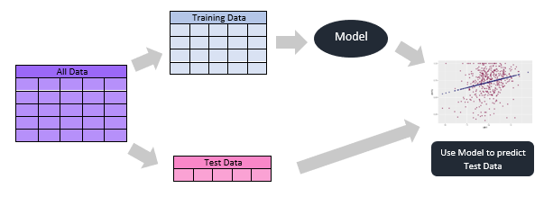
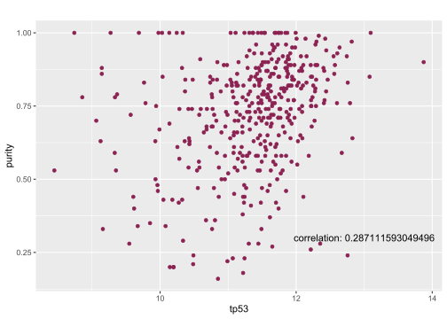
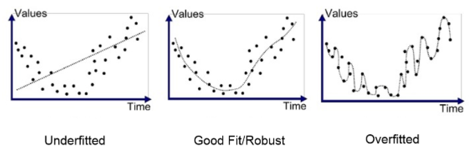
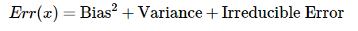

Supervised Learning - Linear Regression
================

Unlike unsupervised learning, supervised learning has a goal in mind -
we are trying to predict an outcome using some model. We have already
accomplished this to some degree with the linear/logistic models we have
created. But let’s take it a step further - let’s talk about training
data and test data. When we create models it is usually with the intent
that we are going to predict something. When we have only one dataset,
we accomplish this by splitting our data into training and test data:



So in this illustration you see that we split our data set into training
and test data, create a model off the training data, then use that model
to try and predict the test data. Let’s try it with methods we have
learned so far.

``` r
#let's load our data 
load("./lgg.rda")
library(ggplot2)
library(limma)
#normalize data
log_trans <- log2(lgg$ExpressionData+1)
norm_data <- normalizeQuantiles(log_trans)
#grab tp53 expression and purity
tp53 <- as.numeric(norm_data[grepl("TP53",rownames(norm_data)),][!is.na(
  lgg$PatientData$paper_ABSOLUTE.purity
  )
][1,]
)
purity <- lgg$PatientData$paper_ABSOLUTE.purity[!is.na(
  lgg$PatientData$paper_ABSOLUTE.purity
  )]
#make a data frame of the two and remove NAs
df <- data.frame(
  tp53,
  purity
)
df <- na.omit(df)
#plot our data for a cursory examination
ggplot(df, aes(x=tp53, y=purity)) + 
  geom_point(color="violetred4")+
  ggtitle("")+
  annotate("text", x=13, y=0.3, label= paste("correlation: ",as.character(cor(df$tp53,df$purity)),sep = ""))
```

<!-- -->

Here we see a weak correlation is present between TP53 expression and
tumor purity. This is an encouraging sign that there is something here.
Now let’s split our data and build our model\!

``` r
#split data into training and test data
train_ind <- sample(1:nrow(df), 0.8*nrow(df))
train <- df[train_ind, ]
test  <- df[-train_ind, ]
#create a model to predict purity from mutation count
model <- lm(purity~tp53,data = train)
summary(model)
```

    ## 
    ## Call:
    ## lm(formula = purity ~ tp53, data = train)
    ## 
    ## Residuals:
    ##     Min      1Q  Median      3Q     Max 
    ## -0.5862 -0.1083  0.0243  0.1239  0.4573 
    ## 
    ## Coefficients:
    ##             Estimate Std. Error t value Pr(>|t|)    
    ## (Intercept) -0.07432    0.14322  -0.519    0.604    
    ## tp53         0.07060    0.01256   5.619 4.07e-08 ***
    ## ---
    ## Signif. codes:  0 '***' 0.001 '**' 0.01 '*' 0.05 '.' 0.1 ' ' 1
    ## 
    ## Residual standard error: 0.1758 on 332 degrees of freedom
    ## Multiple R-squared:  0.08685,    Adjusted R-squared:  0.0841 
    ## F-statistic: 31.58 on 1 and 332 DF,  p-value: 4.066e-08

``` r
#predict purity from our test data
predicted_purity <- predict(model,newdata = test)
#make df between predicted values and actual values
df_pred <- data.frame(
  test$purity,
  predicted_purity
)
#let's define a function to get root mean square error:
ModelRMSE <- function(actual, predicted) {
  sqrt(mean((actual - predicted) ^ 2))
}
ModelRMSE(actual = train$purity, predicted = predict(model,train))
```

    ## [1] 0.1753183

``` r
ModelRMSE(actual = test$purity, predicted = predict(model,test))
```

    ## [1] 0.2094269

So here we split our data into test and training data, used the training
data to make a model and then used that model to make predictions on our
test data. Then we introduced a new term `rmse`. This is the root mean
square error, a measure of deviation between the actual values and the
predicted values
([Wikipedia](https://en.wikipedia.org/wiki/Root-mean-square_deviation)).
When both the training and test rmse are high we are typically
underfitting the model ([towards data
science](https://towardsdatascience.com/what-does-rmse-really-mean-806b65f2e48e)).
When we have a low training rmse and a high test rmse, we have a model
that is overfitting the data ([towards data
science](https://towardsdatascience.com/what-does-rmse-really-mean-806b65f2e48e)).
But what does under/overfitting mean? Let’s use pictures
([medium](https://medium.com/greyatom/what-is-underfitting-and-overfitting-in-machine-learning-and-how-to-deal-with-it-6803a989c76)):



So here we see that underfitting isn’t explaining our data enough, and
overfiting explains the data too well. We need a model in somewhere in
the middle. We can see from the two rmse values above, that the two rmse
values are rather close indicating a more robust model.

## Bias-Variance Tradeoff

We touched on the term rmse as a metric of model accuracy and as a way
to identify if a model is over or underfitting the data. Let’s better
understand the term rmse. The square of this, mean square error, is
equal to the following ([towards data
science](https://towardsdatascience.com/understanding-the-bias-variance-tradeoff-165e6942b229)):



Here we introduce some terms - bias, variance and irreducible error. So
bias and variance are the reducible error, basically we reduced the
error to those terms. The irreducible error is the error we can’t change
by modifying our model ([towards data
science](https://towardsdatascience.com/understanding-the-bias-variance-tradeoff-165e6942b229)).
Models are biased when they are too simple and oversimplify the
relationship (underfitting) and have more variance if they take in too
many variables and make the relationship so complex that they really
just memorizing the training data (overfitting) ([towards data
science](https://towardsdatascience.com/understanding-the-bias-variance-tradeoff-165e6942b229)).

## References

1.  <https://en.wikipedia.org/wiki/Root-mean-square_deviation>

2.  <https://towardsdatascience.com/what-does-rmse-really-mean-806b65f2e48e>

3.  <https://medium.com/greyatom/what-is-underfitting-and-overfitting-in-machine-learning-and-how-to-deal-with-it-6803a989c76>

4.  <https://towardsdatascience.com/understanding-the-bias-variance-tradeoff-165e6942b229>
