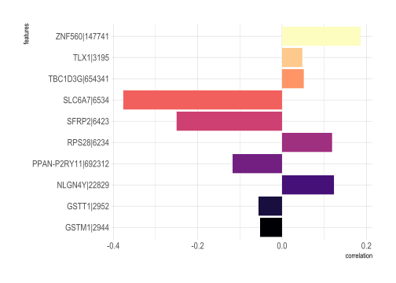
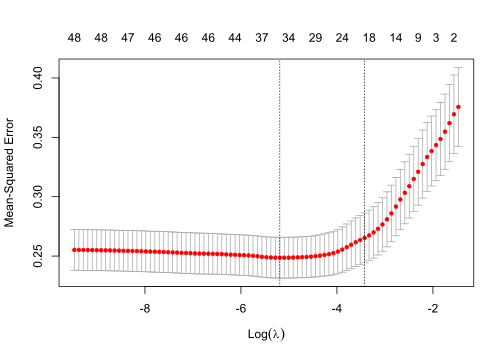

Supervised Learning - Model Selection Part 2
================

In the first topic note on model selection we covered how to get a rough
estimate of how many features are appropriate for a given model. In this
topic note we will explore a few methods on how to select *which*
features should be picked. But before we get started let’s do a little
setup.

``` r
load("lgg.rda")
library(limma)
#we are going to do something different here and use our gene expression data
#let's first filter, normalize and grab only the top 50 genes with the
#highest variance
filt.exp <- lgg$ExpressionData[rowMeans(lgg$ExpressionData)>10,]
log_trans <- log2(filt.exp+1)
norm_data <- normalizeQuantiles(log_trans)
vars <- rank(-apply(norm_data,1,var))<=50
#here we make sure our predictor variables are the columns
df <- as.data.frame(t(norm_data[vars,]))
df["idh1"] <- as.numeric(norm_data[grepl("IDH1",rownames(norm_data)),])
```

## Correlation Based Approach

A simple but nonetheless effective way of feature selection is selection
by correlating variables with what you are trying to predict.

``` r
library(ggplot2)
library(viridis)
library(hrbrthemes)
library(gridExtra)

cor_select <- function(num_of_features,y,df,penalty){
#correlate features to each other
  cors <- cor(df,use="pairwise")
#correlate features to the response variable
  cors2y <- abs(cor(y,df[,1:50]))
#select the feature with the highest correlation
  sel <- which.max(cors2y)
#loop through desired number of features -1 and subtract the sum of the
#correlations to the features already selected
  for (i in 1:(num_of_features-1)){
    sums_of_cors = apply(abs(cors[sel,,drop=F]),2,sum)
    score = cors2y - penalty*sums_of_cors
    for ( j in order(score,decreasing=T)) {
      if ( !j %in% sel ){
        sel = c(sel,j)
        break
      }
    }
  }
  return(sel)
}
features <- cor_select(
  num_of_features = 10,
  y=df[,51],
  df=df[,1:50],
  penalty = 0.5
)
plotting.df <- data.frame(
  features=names(df)[features],
  correlation=cor(df[,51],df[,1:50])[features]
)
ggplot(plotting.df, aes(x=features, y=correlation,fill=as.factor(features)))+ 
            geom_bar(stat = "identity")+
            scale_fill_manual(values = magma(dim(plotting.df)[1]))+ 
            theme_ipsum()+
            coord_flip()+
            theme(legend.position = "none")
```

<!-- -->

Here we are essentially grabbing the feature that has the highest
correlation with the response variable and then adding subsequent
correlated features so long as they don’t correlate with the features
already added. Which makes sense, you don’t want to add features that
are correlated with each other - you wouldn’t be gaining any new
information.

## LASSO/Ridge Regression

Thought we were done with regression? Nope, there are plenty more
flavors of regression out there. Right now we will briefly touch on
Ridge and LASSO regression and why LASSO regression is a better fit for
feature selection. So both LASSO and Ridge utilize something called
regularization. **Regularization** is the process of penalizing models
to avoid models with extreme coefficients
([statisticshowto](https://www.statisticshowto.com/regularization/)).
LASSO and Ridge regression add different penalties to accomplish this.
**LASSO regression** penalizes using the absolute value of the magnitude
of coefficients, this is also called **L1 Regularization**
([statisticshowto](https://www.statisticshowto.com/regularization/)).
**Ridge regression** penalizes using the the square of the magnitude of
coefficients, this is also called **L2 Regularization**
([statisticshowto](https://www.statisticshowto.com/regularization/)).

Now why is LASSO better for feature selection? Well in Ridge regression,
all coefficients are shrunk by the same factor while in LASSO regression
coefficients are shrunk by varying degrees with some becoming zero
([statisticshowto](https://www.statisticshowto.com/regularization/)).
Reducing some coefficients to zero is what helps you select your model
features - those with non-zero coefficients are your selected features\!

Now let’s do this in R\!

``` r
library(glmnet)
#run our lasso regression on our data
lasso <- cv.glmnet(as.matrix(df[,1:50]), df[,51],nfolds = 10,
                   alpha=1, standardize=TRUE)
#plot log of the lambda values against mean square 
plot(lasso)
```

<!-- -->

So here we run the `cv.glmnet()` function on our potential features and
the response variable. This function runs cross validation on lasso
regression models and delivers a plot of lambda values vs. mean squared
error. Along the top of the plot are the number of features used. The
vertical lines are the minimum lambda and 1se lambda values which can be
used to select features. Here we use the minimum lambda value in feature
selection.

``` r
#what is the optimal lambda value
cat('Min Lambda: ',lasso$lambda.min)
```

    ## Min Lambda:  0.005569469

``` r
#what are our desired features?
coefs <- round(as.matrix(coef(lasso,lasso$lambda.min)),2)
coefs[coefs[, 1]!= 0,]
```

    ##        (Intercept)           DAO|1610           EN1|2019         PRLHR|2834 
    ##              11.26              -0.02               0.01              -0.02 
    ##         HOXD8|3234         HOXD9|3235           LTF|4057          PDYN|5173 
    ##               0.01              -0.01               0.01               0.02 
    ##         RPS28|6234         SHOX2|6474        SLC6A7|6534          XIST|7503 
    ##               0.01               0.02              -0.03               0.02 
    ##         KDM5D|8284         ECEL1|9427        POSTN|10631         WIF1|11197 
    ##              -0.02              -0.04               0.01              -0.03 
    ##       NLGN4Y|22829        KCNV1|27012         LHX5|64211      ZNF560|147741 
    ##               0.09              -0.02               0.04               0.03 
    ##   LOC154822|154822         H19|283120 PPAN-P2RY11|692312 
    ##               0.01               0.02              -0.01

Here we print our minimum lambda value and use the `coef()` function to
isolate the coefficients of our lasso regression results. We further
isolate only those that are non-zero and thus of interest. The greater
the coefficient is/ the more negative coefficient is indicates which
features are of interest.

## Recursive Feature Elimination

**Recursive Feature Elimination** works by building a model and
estimating feature importance by iterating through models with different
features sizes. The performance of these models are compared with one
another to determine which size is optimal. So how do we do this in R?

``` r
library(caret)
set.seed(42)
#feature sizes to iterate through
num_features <- c(5:15)
#use cross validated random forest algorithm 
ctrl <- rfeControl(functions = rfFuncs,
                   method = "repeatedcv",
                   repeats = 5,
                   verbose = FALSE)
#run our rfe!
rfe_res <- rfe(x=df[,1:50], y=df[,51],
                 sizes = num_features,
                 rfeControl = ctrl)

rfe_res
```

    ## 
    ## Recursive feature selection
    ## 
    ## Outer resampling method: Cross-Validated (10 fold, repeated 5 times) 
    ## 
    ## Resampling performance over subset size:
    ## 
    ##  Variables   RMSE Rsquared    MAE  RMSESD RsquaredSD   MAESD Selected
    ##          5 0.5070   0.3090 0.4047 0.04817     0.1187 0.03792         
    ##          6 0.4990   0.3301 0.3975 0.05172     0.1311 0.03803         
    ##          7 0.4935   0.3422 0.3910 0.05376     0.1377 0.03925         
    ##          8 0.4860   0.3614 0.3848 0.05236     0.1302 0.03928         
    ##          9 0.4770   0.3846 0.3780 0.04961     0.1235 0.03628         
    ##         10 0.4694   0.4039 0.3732 0.04907     0.1252 0.03635         
    ##         11 0.4642   0.4179 0.3692 0.04968     0.1237 0.03618         
    ##         12 0.4602   0.4280 0.3659 0.04986     0.1227 0.03799         
    ##         13 0.4573   0.4358 0.3637 0.04829     0.1242 0.03675         
    ##         14 0.4560   0.4401 0.3622 0.04933     0.1259 0.03733         
    ##         15 0.4534   0.4460 0.3607 0.04647     0.1226 0.03514         
    ##         50 0.4475   0.4709 0.3563 0.04290     0.1089 0.03316        *
    ## 
    ## The top 5 variables (out of 50):
    ##    DAO|1610, SLC6A7|6534, NLGN4Y|22829, KCNV1|27012, PRLHR|2834

Here we see our different RMSE values and that the desired number of
features is 50. Although, adding all 50 features would certainly lead to
an overfit model. Luckily the rfe algorithm sorts by feature importance
as well. Features are sorted in `rfe_res$optVariables`. But if you
notice we use a new type of algorithm, random forest, when we cross
validated our control. In the next topic note we will dive into random
forests/decision trees.

## References

1.  <https://www.statisticshowto.com/regularization/>

2.  <https://www.machinelearningplus.com/machine-learning/feature-selection/>
